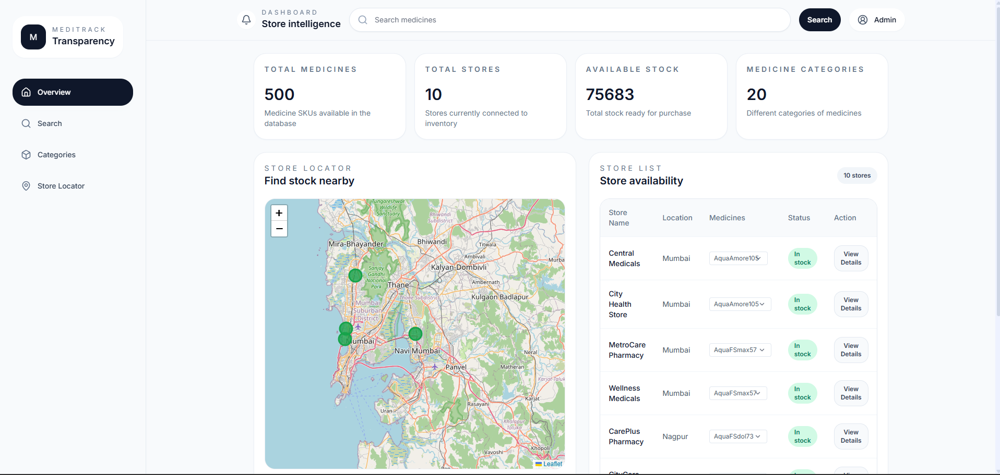
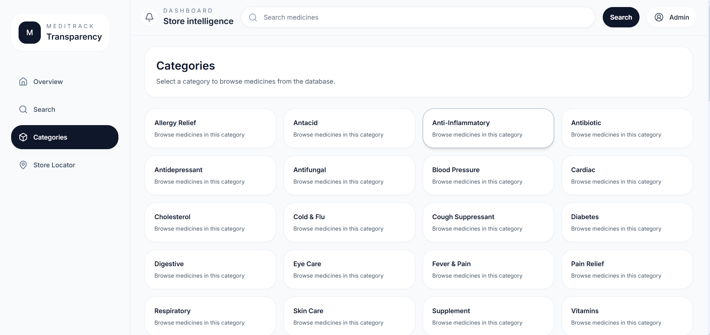
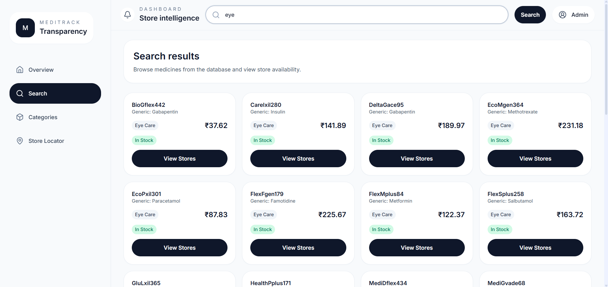
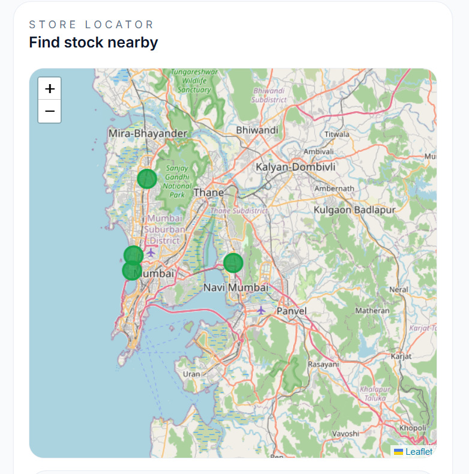

# MediTrack

Medicine Transparency & Store Intelligence Platform

MediTrack is a full-stack healthcare transparency platform that enables users to discover medicines, explore categories, locate nearby pharmacies, and track medicine availability across multiple stores through an interactive analytics dashboard.

The system combines inventory intelligence, medicine discovery, store mapping, and category-based browsing into a single modern web application.

---

## Project Preview

### Dashboard Overview

Provides key inventory metrics including medicine count, connected stores, stock availability, and category insights.



### Category Explorer

Browse medicines through organized healthcare categories for faster discovery.



### Medicine Search

Search medicines instantly and view pricing, availability, and inventory information.



### Store Locator

Locate nearby pharmacies and visualize medicine availability through an interactive map.



---

## Features

### Medicine Discovery

* Search medicines by name
* Browse medicines by category
* View medicine information
* Check inventory availability

### Store Intelligence

* Monitor store inventory
* View medicine availability by location
* Multi-store visibility
* Availability tracking

### Interactive Dashboard

* Medicine statistics
* Store statistics
* Category insights

### Location-Based Search

* Interactive map interface
* Pharmacy location visualization
* Nearby stock discovery

### Modern User Experience

* Responsive interface
* Fast search functionality
* Clean dashboard layout
* Real-time data presentation

---

## Technology Stack

### Frontend

* React.js
* Vite
* Tailwind CSS
* Recharts
* Framer Motion
* Leaflet Maps
* React Leaflet

### Backend

* Node.js
* Express.js
* REST API Architecture

### Database

* SQLite
* MySQL Support

### Development Tools

* Git
* GitHub
* Nodemon

---

## Architecture

text
Frontend (React + Vite)
            │
            ▼
      Express REST API
            │
            ▼
     SQLite / MySQL
```

---

## Project Structure

```text
MediTrace
│
├── frontend/
│   ├── src/
│   │   ├── components/
│   │   ├── data/
│   │   ├── styles/
│   │   ├── App.jsx
│   │   └── main.jsx
│   │
│   ├── package.json
│   └── vite.config.js
│
├── backend/
│   ├── controllers/
│   ├── routes/
│   ├── models/
│   ├── config/
│   ├── scripts/
│   ├── package.json
│   └── server.js
│
├── schema.sql
└── README.md
```

---

## Installation

### Clone Repository

```bash
git clone https://github.com/abhinavkcodes/MediTrace.git
cd MediTrace
```

### Backend Setup

```bash
cd backend
npm install
npm start
```

Backend runs on:

```text
http://localhost:5001
```

### Frontend Setup

```bash
cd frontend
npm install
npm run dev
```

Frontend runs on:

```text
http://localhost:5173
```

---

## API Capabilities

The backend provides RESTful endpoints for:

* Medicine retrieval
* Medicine search
* Category management
* Store information
* Inventory monitoring
* Location-based discovery

Detailed API documentation is available in:

```text
API_DOCUMENTATION.md
```

---

## Key Highlights

* Full-stack healthcare application
* React + Node.js architecture
* Interactive pharmacy locator
* Medicine transparency platform
* Inventory intelligence dashboard
* Category-based medicine discovery
* RESTful backend services
* Responsive modern interface

---

## Future Enhancements

* User authentication
* Real-time stock synchronization
* Price comparison across stores
* Prescription integration
* Notification system
* AI-powered medicine recommendations
* Nearby pharmacy navigation

---

## Author

Abhinav Kumar

GitHub: https://github.com/abhinavkcodes

LinkedIn: https://www.linkedin.com/in/abhinavk71/

---

